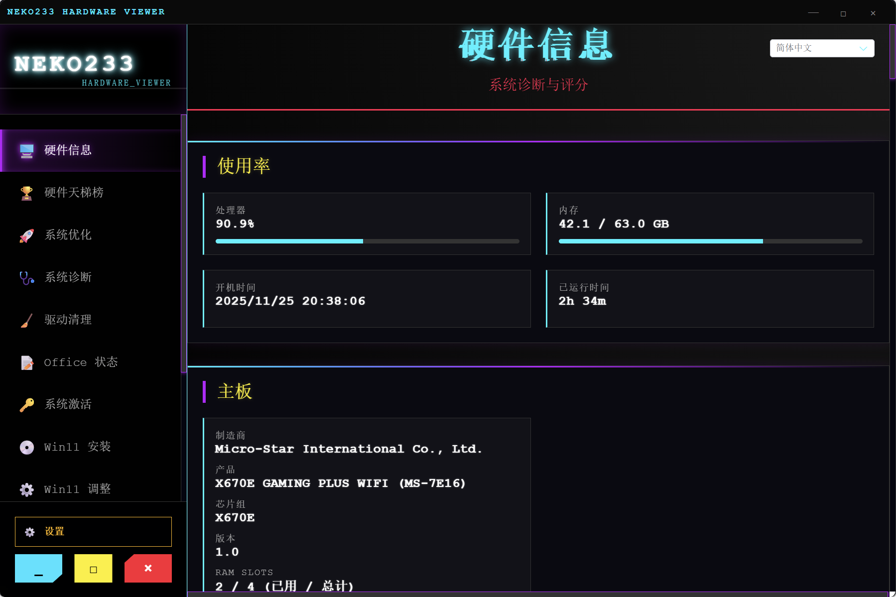

# Neko233 Hardware Viewer

[中文](#中文) | [English](#english)

## 🇨🇳 中文说明

一款具有赛博朋克美学的综合系统实用工具套件。

# 演示图 

### ✨ 功能列表

#### 🖥️ 硬件信息 (Hardware Info)
| 功能 | 描述 |
| :--- | :--- |
| **实时监控** | 实时 CPU 和 RAM 使用率跟踪。 |
| **主板** | 制造商、型号、版本、序列号。 |
| **CPU** | 名称、核心/线程、时钟速度、性能评分。 |
| **GPU** | 型号、显存、驱动版本、性能评分。 |
| **RAM** | 容量、速度、制造商、部件号、电压、位宽。 |
| **存储** | 型号、容量、接口、序列号（可复制）。 |
| **声卡** | 音频设备枚举。 |
| **驱动链接** | 主要制造商的直接下载链接。 |

#### 🚀 系统优化 (Optimization)
| 功能 | 描述 |
| :--- | :--- |
| **Windows 防火墙** | 切换 Windows 防火墙状态（启用/禁用）。 |
| **Cortana** | 启用或禁用 Cortana 语音助手。 |

#### 🧹 显卡驱动清空 (Driver Cleaner)
| 功能 | 描述 |
| :--- | :--- |
| **驱动扫描** | 扫描已安装的 NVIDIA 和 AMD 显示驱动程序。 |
| **NVIDIA 清理** | 一键卸载所有 NVIDIA 驱动程序。 |
| **AMD 清理** | 一键卸载所有 AMD 驱动程序。 |
| **DDU Lite** | Display Driver Uninstaller 的轻量级替代品。 |

#### 📝 Office 管理 (Office Management)
| 功能 | 描述 |
| :--- | :--- |
| **Office 门户** | 快速访问 Microsoft Office 管理门户。 |
| **部署工具** | 快速访问 Office 部署工具 (ODT)。 |

#### 🔑 系统激活 (Activation)
| 功能 | 描述 |
| :--- | :--- |
| **状态检查** | 查看当前 Windows 激活/许可证状态。 |
| **安装密钥** | 安装自定义 Windows 产品密钥。 |
| **版本切换** | 一键切换到专业版、家庭版、企业版、教育版。 |
| **激活** | 触发 Windows 激活 (slmgr /ato)。 |

#### 💿 安装 Win11 (Install Win11)
| 功能 | 描述 |
| :--- | :--- |
| **绕过 TPM/安全启动** | 应用注册表破解以在不支持的硬件上安装 Win11。 |

### 💡 初衷
由于帮很多朋友安装电脑，和排查硬件问题，科普硬件知识花费了我大量精力，故制作了这款 App。
希望大家用的开心，也欢迎大家提 PR！

### 🤝 贡献规范 (PR Guidelines)
欢迎提交 Pull Request！请遵循以下规范：
1. 确保代码风格一致。
2. 提交前请先运行测试。
3. 描述清晰的提交信息。

### 📄 许可证 (License)
本项目采用 **非商业性开源协议**。
仅供个人学习和研究使用，**严禁用于任何商业用途**。

---

## 🇺🇸 English Description

A comprehensive system utility suite with a Cyberpunk aesthetic.

### ✨ Feature List

#### 🖥️ Hardware Info
| Feature | Description |
| :--- | :--- |
| **Real-time Monitor** | Live CPU & RAM usage tracking. |
| **Motherboard** | Manufacturer, Model, Version, Serial Number. |
| **CPU** | Name, Cores/Threads, Clock Speed, Performance Score. |
| **GPU** | Model, VRAM, Driver Version, Performance Score. |
| **RAM** | Capacity, Speed, Manufacturer, Part Number, Voltage, Width. |
| **Storage** | Model, Capacity, Interface, Serial Number (Copyable). |
| **Sound** | Audio device enumeration. |
| **Driver Links** | Direct download links for major manufacturers. |

#### 🚀 Optimization
| Feature | Description |
| :--- | :--- |
| **Windows Firewall** | Toggle Windows Firewall status (Enable/Disable). |
| **Cortana** | Enable or Disable Cortana voice assistant. |

#### 🧹 Driver Cleaner
| Feature | Description |
| :--- | :--- |
| **Driver Scan** | Scan for installed NVIDIA and AMD display drivers. |
| **NVIDIA Cleaner** | One-click uninstall for all NVIDIA drivers. |
| **AMD Cleaner** | One-click uninstall for all AMD drivers. |
| **DDU Lite** | Lightweight alternative to Display Driver Uninstaller. |

#### 📝 Office Management
| Feature | Description |
| :--- | :--- |
| **Office Portal** | Quick access to Microsoft Office management portal. |
| **Deployment Tool** | Quick access to Office Deployment Tool (ODT). |

#### 🔑 Activation
| Feature | Description |
| :--- | :--- |
| **Status Check** | View current Windows activation/license status. |
| **Install Key** | Install a custom Windows Product Key. |
| **Edition Switcher** | One-click switch to Pro, Home, Enterprise, Education editions. |
| **Activate** | Trigger Windows activation (slmgr /ato). |

#### 💿 Install Win11
| Feature | Description |
| :--- | :--- |
| **Bypass TPM/SecureBoot** | Apply registry hacks to install Win11 on unsupported hardware. |
| **Official Download** | Direct link to Microsoft Windows 11 ISO download. |

### ⚙️ Win11 Zone (Win11 专区)
| Feature | Description |
| :--- | :--- |
| **Classic Context Menu** | Restore Windows 10 style right-click menu. |
| **File Extensions** | Toggle visibility of file extensions. |
| **Hidden Files** | Toggle visibility of hidden files. |
| **Restart Explorer** | Instantly restart Windows Explorer to apply changes. |

### 🎭 Features (特性功能)
| Feature | Description |
| :--- | :--- |
| **Fake Shutdown** | Simulate a realistic Windows shutdown screen. |
| **Fake Update** | Simulate a realistic Windows update screen (Full screen). |
| **Fake BSOD** | Simulate a Blue Screen of Death (BSOD). |
| **Exit Mode** | Press **ESC** to exit any fake screen. |

---

## 📦 Download & Install

Check the [Releases](https://github.com/neko233-com/neko233-hardware-viewer/releases) page for the latest installer.

## 💡 Motivation

I created this app because I spent a lot of energy helping friends install computers, troubleshoot hardware issues, and explain hardware knowledge.
I hope you enjoy using it, and PRs are welcome!

## 🤝 Contributing (PR Guidelines)

Pull Requests are welcome! Please follow these guidelines:

1. Ensure consistent code style.
2. Run tests before submitting.
3. Write clear commit messages.

## 📄 License

This project is licensed under a **Non-Commercial Open Source License**.
For personal learning and research use only. **Strictly prohibited for commercial use.**

